# NOVA (Neural Online Virtual Assistant) - Enterprise AI Platform

NOVA is a production-quality, modular, privacy-focused AI Assistant and Operating System platform. Built on Clean Architecture and SOLID design principles, NOVA provides a local-first AI engine, session management, resilient memory persistence, controlled permission management, path security, isolated environment management, dependency auto-detection, error classification, self-debugging, and telemetry monitoring.

---

## 🏗️ Architecture Diagram

```mermaid
graph TD
    App[main.py / CLI Interface] --> Bootstrap[ApplicationBootstrap]
    Bootstrap --> Config[ConfigManager]
    Bootstrap --> Logger[LoggerManager]
    Bootstrap --> Services[ServiceManager]

    subgraph Service Registry
        Services --> FS[FileSystemService]
        Services --> Mem[MemoryService]
        Services --> OllamaCheck[OllamaService]
        Services --> AIEngine[AIEngineService]
        Services --> Perms[PermissionManager]
        Services --> Agent[CodingAgent]
    end

    subgraph AI Engine Subsystem
        AIEngine --> Client[OllamaClient REST]
        AIEngine --> Prompt[PromptBuilder]
        AIEngine --> Identity[SystemPromptManager]
        AIEngine --> Session[SessionManager]
        AIEngine --> Processor[ResponseProcessor]
        AIEngine --> Status[AIStatusManager]
    end

    subgraph Environment & Execution Subsystem
        Agent --> EnvMgr[EnvironmentManager]
        Agent --> DepMgr[DependencyManager]
        Agent --> Runner[ProjectRunner]
        Agent --> ErrAnalyzer[ErrorAnalyzer]
        Agent --> TestRunner[TestRunner]
        Agent --> StateMgr[ProjectStateManager]
    end

    subgraph Security & Permissions
        Perms --> PathCheck[Path Traversal & Boundary Safety]
        Perms --> Policy[SAFE / CONFIRM / BLOCKED Policy]
        EnvMgr --> Perms
        DepMgr --> Perms
        Runner --> Perms
    end

    subgraph Persistent Storage
        Mem --> MemoryFiles[data/memory/*.json]
        Session --> SessionFiles[data/memory/sessions/*.json]
        StateMgr --> ProjectState[data/memory/project_state.json]
        Logger --> LogFiles[data/logs/nova.log]
    end

    Client -->|HTTP localhost:11434| Ollama[Local Ollama Server / qwen2.5:14b]
```



---

## 🌟 Progress & Feature Summary

### Day 1 Summary (Infrastructure Foundation)
- **Bootstrap Pipeline**: Sequential initialization sequence with robust exception boundaries.
- **Folder Auto-Creation**: Automatically creates `config`, `data`, `data/memory`, and `data/logs`.
- **Config & Logging System**: JSON-based settings with default fallback merging, ANSI colored console logs, and rotating file logs.
- **Memory Infrastructure**: JSON memory files (`short_term.json`, `long_term.json`, `user_profile.json`, `system_state.json`) with auto-repair capability.
- **Service Manager**: Dynamic service registry facilitating dependency injection and health lifecycle.

### Day 2 Summary (AI Engine & Brain Integration)
- **Dedicated AI Engine (`AIEngineService`)**: Central gateway managing all LLM communication, registered into `ServiceManager`.
- **Ollama REST Client (`OllamaClient`)**: Low-level client for Ollama API (`/api/chat`, `/api/generate`, `/api/tags`, `/api/version`), featuring retries, timeouts, and connection failure handling.
- **Prompt Builder (`PromptBuilder`)**: Merges System Prompt + Conversation History + User Input + Memory Context into clean Ollama payloads.
- **Permanent Identity (`SystemPromptManager`)**: Defines NOVA's personality, senior coding engineer role, local-first privacy rules, permission philosophy, and custom user instruction merging.
- **Multi-Session Management (`SessionManager`)**: Supports multiple independent named sessions (e.g. "Python Project", "Interview", "Default") saved to disk under `data/memory/sessions/*.json`.
- **Response Processor (`ResponseProcessor`)**: Normalizes whitespace, extracts fenced code blocks, and calculates word/character telemetry.
- **AI Status Telemetry (`AIStatusManager`)**: Tracks response latency, request counts, error counts, loaded model, and active session state.
- **Interactive CLI & Command Mode**: Provides `--chat` interactive session loop and `--prompt "<text>"` execution modes.

### Day 3 Summary (Tool Architecture, Security & Initial Test Suite)
- **Permission Manager (`PermissionManager`)**: Action risk classifier (`SAFE`, `CONFIRM`, `BLOCKED`) preventing execution of dangerous commands (e.g., `rm -rf /`, `format`, destructive system commands).
- **Security & Path Protection**: Enforces workspace boundary validation (`is_safe_path`), blocking path traversal attacks (`../secret.txt`) and unauthorized external absolute paths.
- **Enhanced Memory Operations**: Dynamic store creation, retrieval, listing, deletion, and auto-discovery of custom memory stores.
- **Automated Test Suite**: Built-in test suite covering AI engine, memory, permission manager, security path protection, and multi-session subsystems.

### Day 4 Summary (Environment Manager, Dependency Manager & Autonomous Coding Workflow)
- **Environment Manager (`EnvironmentManager`)**: Language detection (Python, Node.js, Java), Python version discovery, virtual environment detection (`.venv`, `venv`, `env`), permission-controlled `.venv` creation, and health checks.
- **Dependency Manager (`DependencyManager`)**: Manifest parsing (`requirements.txt`, `pyproject.toml`, `Pipfile`), missing package detection, permission-controlled `pip install` into project `.venv`, and installation verification.
- **Project Runner (`ProjectRunner`)**: Entry point discovery (`main.py`, `app.py`, `run.py`), safe process execution within active environments, stdout/stderr/exit_code capture, and timeout guards.
- **Error Analyzer (`ErrorAnalyzer`)**: Automated classification of error types (`SyntaxError`, `ModuleNotFoundError`, `ImportError`, `FileNotFoundError`, `TypeError`, `RuntimeError`, etc.) and structured cause/fix recommendations.
- **Test Runner (`TestRunner`)**: Execution of `unittest` and `pytest` test suites with output parsing (passed, failed, skipped, errors, execution time).
- **Project State Manager (`ProjectStateManager`)**: Workspace task tracking, active environment state, installed dependencies, modified files, execution/test history, and JSON persistence (`data/memory/project_state.json`).
- **Autonomous Coding Agent (`CodingAgent`)**: End-to-end autonomous workflow (`UNDERSTAND -> DETECT ENVIRONMENT -> DETECT DEPENDENCIES -> PLAN -> PERMISSION CHECK -> PREPARE ENVIRONMENT -> INSTALL DEPENDENCIES -> RUN -> CLASSIFY ERROR -> PROPOSE FIX -> PERMISSION -> APPLY FIX -> VERIFY -> SAVE MEMORY`) with self-debugging loop capped at `MAX_DEBUG_ATTEMPTS = 3`.
- **Comprehensive Day 4 Test Suite**: 26 new automated unit and end-to-end integration tests (bringing total suite to 48 tests).

---

## 📂 Project Structure

```
Nova-ai/
├── config/
│   └── settings.json           # Global configuration file
├── data/
│   ├── logs/
│   │   └── nova.log            # Rotating application log
│   └── memory/
│       ├── long_term.json      # Persistent knowledge & facts
│       ├── project_state.json  # Workspace task & environment state
│       ├── short_term.json     # Active session buffer
│       ├── system_state.json   # Boot & execution telemetry
│       ├── user_profile.json   # User identity & custom directives
│       └── sessions/           # Multi-session chat history storage
│           ├── default.json
│           └── ...
├── nova/
│   ├── __init__.py
│   ├── __main__.py             # Module entry point
│   ├── banner.py               # Visual startup banner renderer
│   ├── bootstrap.py            # Application bootstrap orchestrator
│   ├── agent/                  # Day 4 Coding Agent Subsystem
│   │   ├── __init__.py
│   │   └── coding_agent.py     # End-to-end autonomous coding workflow
│   ├── ai/                     # Day 2 AI Subsystem
│   │   ├── __init__.py
│   │   ├── ai_status_manager.py # Performance telemetry
│   │   ├── conversation_manager.py # In-memory message history
│   │   ├── engine.py           # AIEngineService orchestrator
│   │   ├── exceptions.py       # AI specific exceptions
│   │   ├── ollama_client.py    # Low-level REST client
│   │   ├── prompt_builder.py   # Prompt assembly
│   │   ├── response_processor.py # Output cleanup & code extraction
│   │   ├── session_manager.py  # Multi-session persistence
│   │   └── system_prompt.py    # NOVA identity & directives
│   ├── core/
│   │   ├── __init__.py
│   │   ├── base_service.py     # BaseService contract & ServiceStatus
│   │   ├── config.py           # ConfigManager
│   │   ├── logger.py           # LoggerManager & ColoredConsoleFormatter
│   │   └── service_manager.py  # Service registry & health monitoring
│   ├── environment/            # Day 4 Environment & Dependency Subsystems
│   │   ├── __init__.py
│   │   ├── dependency_manager.py # Manifest parsing & permission pip install
│   │   └── environment_manager.py # Language & venv detection / creation
│   ├── permissions/            # Day 3 Permissions & Security
│   │   ├── __init__.py
│   │   └── permission_manager.py # Permission classification & path safety
│   ├── project/                # Day 4 Project Runner & Error Analysis
│   │   ├── __init__.py
│   │   ├── error_analyzer.py   # Error classification & root cause analysis
│   │   ├── project_runner.py   # Entry point discovery & process runner
│   │   ├── state_manager.py    # Workspace state persistence
│   │   └── test_runner.py      # unittest/pytest test runner & telemetry
│   ├── services/
│   │   ├── __init__.py
│   │   ├── filesystem_service.py # Workspace directory verification & path safety
│   │   ├── memory_service.py   # Memory store management & dynamic discovery
│   │   └── ollama_service.py   # Ollama daemon probe
│   └── utils/
│       ├── __init__.py
│       └── constants.py         # System constants & exception hierarchy
├── tests/                      # Automated Unit & Integration Tests
│   ├── __init__.py
│   ├── test_ai_engine.py       # AI Engine initialization & mock LLM tests
│   ├── test_day4_e2e.py        # Day 4 end-to-end autonomous workflow test
│   ├── test_debugging_workflow.py # Self-debugging loop & retry cap tests
│   ├── test_dependencies.py    # Dependency parsing & installation permission tests
│   ├── test_environment.py     # Environment detection & venv creation tests
│   ├── test_error_analyzer.py  # Error classification & analysis tests
│   ├── test_memory.py          # Memory CRUD, persistence, & recovery tests
│   ├── test_permissions.py     # Permission classification & rule safety tests
│   ├── test_project_runner.py  # Process execution & output capture tests
│   ├── test_security.py        # Path traversal & boundary security tests
│   └── test_sessions.py       # Multi-session creation, loading, & isolation tests
├── .gitignore                  # Git ignore rules
├── main.py                     # Root CLI entry point
├── requirements.txt            # Project dependencies
└── README.md                   # System documentation
```

---

## 🛠️ Technology Stack

- **Language**: Python 3.9+ (Clean Architecture, Type Hints, Dataclasses)
- **LLM Runtime**: Local [Ollama](https://ollama.com/) Server (`http://localhost:11434`)
- **Default LLM Model**: `qwen2.5:14b`
- **Network Client**: Standard Library (`urllib.request`) with zero-dependency execution
- **Storage**: Structured Local JSON (`data/memory/`, `data/memory/sessions/`)
- **Testing**: Built-in `unittest` Framework (Zero External Test Dependencies)

---

## 🚀 How to Run NOVA

### 1. Single Prompt Execution
```bash
python main.py --prompt "Explain the architectural pattern used in NOVA."
```

### 2. Interactive Conversation CLI
```bash
python main.py --chat
```

#### Interactive Commands in Chat Mode:
- `/session` - List all session threads
- `/session create <name>` - Create and switch to a new session (e.g. `/session create Python Project`)
- `/session switch <id>` - Switch to an existing session
- `/status` - Display AI Engine latency and telemetry
- `/clear` - Clear history for active session
- `/exit` - Exit chat mode

---

## 🔒 Security Model & Permission Architecture

NOVA strictly enforces boundary discipline and permission checks across all operations:

1. **Permission Levels**:
   - **`SAFE`**: Read-only operations (file reading, directory scanning, `git status`, `ls`). Executed automatically.
   - **`CONFIRM`**: State-changing operations (file modification, environment creation, `pip install`, program execution). Requires explicit user approval (`YES`/`NO`).
   - **`BLOCKED`**: Destructive system actions (e.g., `rm -rf /`, `format C:`, system shutdown, directory traversal). Blocked automatically.
2. **Workspace Isolation**: All file operations and environment creations are checked against `is_safe_path()` to ensure execution remains strictly within the workspace root.
3. **No Silent Actions**: Dependency installations and environment creations are never performed silently or globally without user permission.

---

## 🧪 Running Automated Tests

NOVA includes a comprehensive automated test suite of **48 unit and integration tests** built with Python's built-in `unittest` framework.

To discover and execute all unit and integration tests:

```bash
python -m unittest discover -s tests -p "test_*.py"
```

### Test Suite Coverage:
1. **`test_ai_engine.py`**: AI Engine initialization, prompt execution, empty prompt guards, and Ollama daemon error handling.
2. **`test_memory.py`**: Memory store CRUD, JSON persistence, and corrupted file recovery.
3. **`test_permissions.py`**: Permission level classification and dangerous command rejection.
4. **`test_security.py`**: Path traversal protection (`../secret.txt`) and workspace boundary enforcement.
5. **`test_sessions.py`**: Independent multi-session creation, switching, disk loading, and history isolation.
6. **`test_environment.py`**: Python interpreter detection, venv detection, `.venv` creation, and environment health checks.
7. **`test_dependencies.py`**: `requirements.txt` and `pyproject.toml` parsing, missing package detection, and installation permission guards.
8. **`test_project_runner.py`**: Entry point discovery (`main.py`), process execution, stdout/stderr capture, and timeout guards.
9. **`test_error_analyzer.py`**: Classification of syntax errors, missing module errors, import errors, file errors, and clean exit handling.
10. **`test_debugging_workflow.py`**: Self-debugging loop, missing module auto-recommendation, and retry counter cap (`MAX_DEBUG_ATTEMPTS = 3`).
11. **`test_day4_e2e.py`**: Complete end-to-end lifecycle test covering project analysis, environment preparation, dependency check, execution, state persistence, and memory recording.

---

## 🗺️ Next Day Roadmap (Day 5 & Beyond)

- **Day 5 (Voice & Multi-Modal Processing)**: Voice recognition, wake word, speech synthesis.
- **Day 6 (Multi-Agent & Task Systems)**: Autonomous sub-agent orchestration and background task runner.

---

## 📌 Version & Changelog

- **v1.0.0-day1**: Initial foundation (Config, Logger, ServiceManager, FileSystem, Memory, Ollama Probe).
- **v1.0.0-day2**: Added AI Engine (`AIEngineService`), OllamaClient, PromptBuilder, SystemPromptManager, SessionManager, ConversationManager, ResponseProcessor, and interactive CLI.
- **v1.0.0-day3**: Added `PermissionManager`, path security validation (`is_safe_path`), memory store listing/deletion/recovery, and initial test suite (`tests/`).
- **v1.0.0-day4**: Added `EnvironmentManager`, `DependencyManager`, `ProjectRunner`, `ErrorAnalyzer`, `TestRunner`, `ProjectStateManager`, `CodingAgent` workflow, self-debugging loop, and comprehensive Day 4 test suite.
