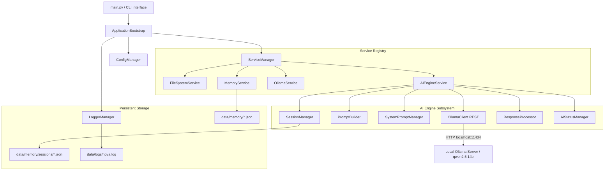

# NOVA (Neural Online Virtual Assistant) - Enterprise AI Platform

NOVA is a production-quality, modular, privacy-focused AI Assistant and Operating System platform. Built on Clean Architecture and Solid design principles, NOVA provides a local-first AI engine, session management, resilient memory persistence, and telemetry monitoring.

---

## 🏗️ Architecture Diagram



---

## 🌟 Progress & Feature Summary

### Day 1 Summary (Infrastructure Foundation)
- **Bootstrap Pipeline**: Sequential initialization sequence with robust exception boundaries.
- **Folder Auto-Creation**: Automatically creates `config`, `data`, `data/memory`, and `data/logs`.
- **Config & Logging System**: JSON-based settings with default fallback merging, ANSI colored console logs, and rotating file logs.
- **Memory Infrastructure**: JSON memory files (`short_term.json`, `long_term.json`, `user_profile.json`, `system_state.json`) with auto-repair capability.
- **Service Manager**: Dynamic service registry facilitating dependency injection and health lifecycle.

### Day 2 Summary (AI Engine & Brain Integration)
- **Dedicated AI Engine (`AIEngineService`)**: Central gateway managing all LLM communication, registered into `ServiceManager`.
- **Ollama REST Client (`OllamaClient`)**: Low-level client for Ollama API (`/api/chat`, `/api/generate`, `/api/tags`, `/api/version`), featuring retries, timeouts, and connection failure handling.
- **Prompt Builder (`PromptBuilder`)**: Merges System Prompt + Conversation History + User Input + Memory Context into clean Ollama payloads.
- **Permanent Identity (`SystemPromptManager`)**: Defines NOVA's personality, senior coding engineer role, local-first privacy rules, permission philosophy, and custom user instruction merging.
- **Multi-Session Management (`SessionManager`)**: Supports multiple independent named sessions (e.g. "Python Project", "Interview", "Default") saved to disk under `data/memory/sessions/*.json`.
- **Response Processor (`ResponseProcessor`)**: Normalizes whitespace, extracts fenced code blocks, and calculates word/character telemetry.
- **AI Status Telemetry (`AIStatusManager`)**: Tracks response latency, request counts, error counts, loaded model, and active session state.
- **Interactive CLI & Command Mode**: Provides `--chat` interactive session loop and `--prompt "<text>"` execution modes.

---

## 📂 Project Structure

```
Nova-ai/
├── config/
│   └── settings.json           # Global configuration file
├── data/
│   ├── logs/
│   │   └── nova.log            # Rotating application log
│   └── memory/
│       ├── long_term.json      # Persistent knowledge & facts
│       ├── short_term.json     # Active session buffer
│       ├── system_state.json   # Boot & execution telemetry
│       ├── user_profile.json   # User identity & custom directives
│       └── sessions/           # Multi-session chat history storage
│           ├── default.json
│           └── ...
├── nova/
│   ├── __init__.py
│   ├── __main__.py             # Module entry point
│   ├── banner.py               # Visual startup banner renderer
│   ├── bootstrap.py            # Application bootstrap orchestrator
│   ├── ai/                     # Day 2 AI Subsystem
│   │   ├── __init__.py
│   │   ├── ai_status_manager.py # Performance telemetry
│   │   ├── conversation_manager.py # In-memory message history
│   │   ├── engine.py           # AIEngineService orchestrator
│   │   ├── exceptions.py       # AI specific exceptions
│   │   ├── ollama_client.py    # Low-level REST client
│   │   ├── prompt_builder.py   # Prompt assembly
│   │   ├── response_processor.py # Output cleanup & code extraction
│   │   ├── session_manager.py  # Multi-session persistence
│   │   └── system_prompt.py    # NOVA identity & directives
│   ├── core/
│   │   ├── __init__.py
│   │   ├── base_service.py     # BaseService contract & ServiceStatus
│   │   ├── config.py           # ConfigManager
│   │   ├── logger.py           # LoggerManager & ColoredConsoleFormatter
│   │   └── service_manager.py  # Service registry & health monitoring
│   ├── services/
│   │   ├── __init__.py
│   │   ├── filesystem_service.py # Workspace directory verification
│   │   ├── memory_service.py   # Memory store management
│   │   └── ollama_service.py   # Ollama daemon probe
│   └── utils/
│       ├── __init__.py
│       └── constants.py         # System constants & exception hierarchy
├── .gitignore                  # Git ignore rules
├── main.py                     # Root CLI entry point
├── requirements.txt            # Project dependencies
└── README.md                   # System documentation
```

---

## 🛠️ Technology Stack

- **Language**: Python 3.9+ (Clean Architecture, Type Hints, Dataclasses)
- **LLM Runtime**: Local [Ollama](https://ollama.com/) Server (`http://localhost:11434`)
- **Default LLM Model**: `qwen2.5:14b`
- **Network Client**: Standard Library (`urllib.request`) with zero-dependency execution
- **Storage**: Structured Local JSON (`data/memory/`, `data/memory/sessions/`)

---

## 🚀 How to Run NOVA

### 1. Single Prompt Execution
```bash
python main.py --prompt "Explain the architectural pattern used in NOVA."
```

### 2. Interactive Conversation CLI
```bash
python main.py --chat
```

#### Interactive Commands in Chat Mode:
- `/session` - List all session threads
- `/session create <name>` - Create and switch to a new session (e.g. `/session create Python Project`)
- `/session switch <id>` - Switch to an existing session
- `/status` - Display AI Engine latency and telemetry
- `/clear` - Clear history for active session
- `/exit` - Exit chat mode

---

## 🗺️ Next Day Roadmap (Day 3 & Beyond)

- **Day 3 (Autonomous Code & Execution Context)**: File reading/writing capabilities, workspace context injection into Prompt Builder.
- **Day 4 (Permission & Security Philosophy)**: Action confirmation system, sandbox execution boundaries.
- **Day 5 (Voice & Multi-Modal Processing)**: Voice recognition, wake word, speech synthesis.
- **Day 6 (Multi-Agent & Task Systems)**: Autonomous sub-agent orchestration and background task runner.

---

## 📌 Version & Changelog

- **v1.0.0-day1**: Initial foundation (Config, Logger, ServiceManager, FileSystem, Memory, Ollama Probe).
- **v1.0.0-day2**: Added AI Engine (`AIEngineService`), OllamaClient, PromptBuilder, SystemPromptManager, SessionManager, ConversationManager, ResponseProcessor, and interactive CLI.
